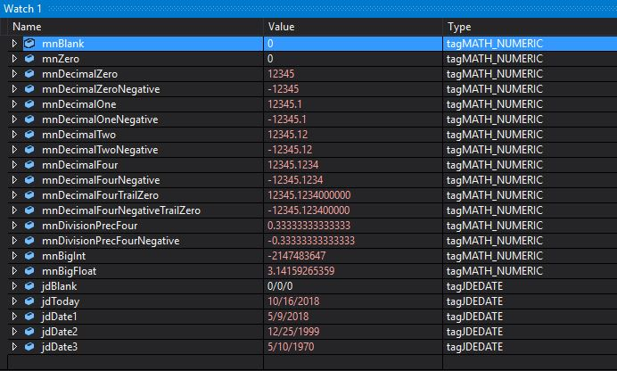

# JDE Types Visual Studio Studio Add-in

Here is a simple add-in for Visual Studio 2013 (and later) to display JDE types correctly when debugging BSFNs and TERs. Namely JDEDATE and MATH_NUMERIC data types.

## Instructions
1. Save the file jde_e1_types.natvis into %VSINSTALLDIR%\Common7\Packages\Debugger\Visualizers. Example: c:\Program Files (x86)\Microsoft Visual Studio 12.0\Common7\Packages\Debugger\Visualizers.
2. Restart Visual Studio.
